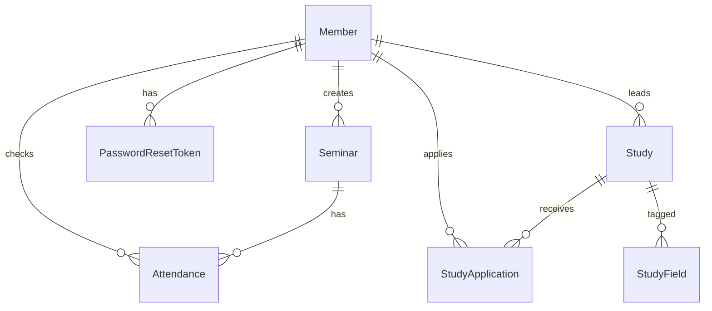

# JARAM 백엔드 설계 · Usecase · API 계약

- 작성일: 2026-06-29
- 상태: 승인됨 (구현 계획 대기)
- 범위: JARAM 웹 백엔드 전체 (auth · people · seminar · study) — 통합 1 spec
- 대상 레포: 별도 Spring Boot 레포 (아직 미생성). 본 문서·계약은 FE 레포에서 파생·관리되며, OpenAPI 계약은 portable하게 BE 레포로 이동/공유한다.

---

## 1. 배경 · 목표

JARAM React 프론트엔드는 이미 완성되어 있고, **백엔드 계약의 대부분을 코드로 인코딩**하고 있다.
각 기능 디렉터리의 `*.api.js`(엔드포인트·요청 payload·에러 코드), `*.queries.js`(읽기 연산·캐시 키),
`*.data.js`(응답 DTO 모양의 시드), 폼/검증 코드(`*.validation.js`, `useForm.js`)가 그것이다.

따라서 백엔드 명세를 **맨땅에서 작성하지 않는다.** FE를 단일 진실원으로 삼아 계약을 **추출**하고,
그 사이에 빠진 **도메인 모델**을 채우고, 전체를 **기계 검증 가능한 OpenAPI 계약**으로 고정한다.
목표는 "낭비 없이 정확하게" — FE/BE 불일치(drift)를 구조적으로 차단하는 것.

## 2. 전략

1. **추출(Extract)** — FE가 이미 의존하는 엔드포인트·payload·응답 shape·에러 코드·인증 모델을 그대로 계약화한다.
2. **도메인 모델 보강** — usecase와 API 사이의 빠진 층(엔티티·관계·역할·상태머신)을 정의한다.
3. **OpenAPI 3.1 단일 계약** — `docs/api/openapi.yaml`. BE는 이 schema 준수를 통합테스트로 검증하고,
   FE는 선택적으로 `openapi-typescript`로 타입을 생성해 현재 손작성 shape를 대체할 수 있다.
4. **얇은 usecase 문서** — 각 usecase는 액터·흐름·엔드포인트·인수조건으로만 기술하고, 상세 schema는 OpenAPI에 위임한다.

> 본 문서(설계+usecase) + `docs/api/openapi.yaml`(계약)이 산출물이며, 이후 writing-plans로 BE 구현 계획을 만든다.

## 3. 아키텍처

표준 Spring Boot 레이어드 구조. 각 계층의 책임을 한 줄로 답할 수 있게 작게 유지한다.

```
Controller  ── OpenAPI operation 1:1. 요청/응답 DTO = OpenAPI schema.
   │
Service     ── 트랜잭션·도메인 규칙(상태 전이, 권한, 파생 필드 계산).
   │
Repository  ── Spring Data JPA.
   │
Entity      ── 영속 모델(§4).
```

- **인증**: Spring Security + JWT 인증 필터. `Authorization: Bearer <accessToken>`.
- **에러**: `@RestControllerAdvice` 전역 핸들러가 단일 envelope(§7)로 직렬화.
- **DTO 네이밍·패키지 구조**는 BE 레포 CLAUDE.md를 따른다(미생성 — 생성 시 본 계약을 기준으로 작성).

## 4. 도메인 모델

### 4.1 엔티티

| 엔티티 | 필드 | 비고 |
|---|---|---|
| **Member** | id, name, studentId(unique), email(unique), passwordHash, authority, title, department?, category, gen?, bio?, githubUrl?, blogUrl?, status, createdAt | 회원·임원 단일 테이블. `authority`로 권한, `category`로 people 탭 분류. |
| **Seminar** | id, title, speaker, topic, startsAt, place, mode?, attendanceCode?, materialUrl?, capacity, createdById, createdAt | `status`는 저장하지 않고 `startsAt`+출석창으로 **파생**. `attendanceCode`는 응답에 노출하지 않음. |
| **Attendance** | id, seminarId, memberId, checkedAt | `unique(seminarId, memberId)`. |
| **Study** | id, title, leaderId, schedule, period, mode, capacity, approvalStatus, rejectionReason?, status, intro, createdAt | `fields`는 별도 태그(아래). |
| **StudyField** | id, studyId, name | Study 1—* (단순 태그 테이블 또는 element collection). |
| **StudyApplication** | id, studyId, applicantId, motive, status, rejectionReason?, createdAt | `unique(studyId, applicantId)` — 중복 신청 차단. |
| **PasswordResetToken** | id, memberId, token(unique), expiresAt, usedAt? | 비밀번호 재설정용 단기 토큰. |

### 4.2 열거형 (enum)

내부 Java enum은 UPPER_CASE, **와이어(JSON) 값은 FE가 이미 소비하는 표기를 그대로 사용**한다(아래 "wire" 열).
이 표기 불일치(예: login 코드는 대문자, 상태는 소문자)는 FE 코드에서 비롯된 것이며 계약상 고정한다.

| enum | 내부 값 | wire 값 |
|---|---|---|
| Member.authority | MEMBER, OFFICER | `MEMBER` / `OFFICER` |
| Member.category | EXEC, CONTRIB, GRAD | `exec` / `contrib` / `grad` |
| Member.status | PENDING, ACTIVE, REJECTED | (로그인 에러 코드로만 노출, §7) |
| Seminar.status (파생) | UPCOMING, ONGOING, ENDED | `upcoming` / `ongoing` / `ended` |
| Study.approvalStatus | PENDING, APPROVED, REJECTED | `pending` / `approved` / `rejected` |
| Study.status | RECRUITING, CLOSED, ONGOING, ENDED | `recruiting` / `closed` / `ongoing` / `ended` |
| Study.applyState (파생, 사용자별) | OPEN, APPLIED, CLOSED, JOINED | `open` / `applied` / `closed` / `joined` |
| StudyApplication.status | PENDING, APPROVED, REJECTED | `pending` / `approved` / `rejected` |

### 4.3 관계 (ERD)



### 4.4 파생 필드 규칙

- **Seminar.status**: `now < startsAt` → `upcoming`; `startsAt ≤ now ≤ startsAt + 출석창` → `ongoing`; 그 외 → `ended`.
  출석창 기본값은 구현 계획에서 확정(예: 시작 후 N분). 출석은 `ongoing`일 때만 허용.
- **Study.status**: `approvalStatus != APPROVED`이면 공개 목록에서 제외. 공개된 스터디의 모집 상태는 정원(`cur < capacity`)과
  운영 단계로 결정한다. `recruiting`↔`closed`는 정원으로 자동 전이, `ongoing`/`ended` 전이 규칙(시작일·종료 처리)은 구현 계획에서 확정한다. `cur` = 승인된 StudyApplication 수 (+ leader).
- **Study.applyState**(사용자별, 인증 시에만 의미 있음): 본인이 leader거나 승인됨 → `joined`; 본인 신청이 PENDING → `applied`;
  모집 마감/정원 초과 → `closed`; 그 외 → `open`.
- **Member(people) gen 표기**: 저장은 정수(예: 41), 응답은 `"41기"` 문자열 또는 null.

## 5. 권한 모델

| 등급 | 정의 | 접근 |
|---|---|---|
| public | 미인증 | 목록 열람(people·seminar·study) |
| member | `authority=MEMBER`, `status=ACTIVE` | + 출석·스터디 신청·스터디 개설 신청·내 활동 |
| officer | `authority=OFFICER` | + 세미나 개설·출석명단·가입/개설/신청 승인·거절 |

- 토큰 무효/만료 → **401** (FE가 세션 clear). 권한 부족 → **403**.
- `status != ACTIVE`(PENDING/REJECTED) 회원은 로그인 자체가 차단된다(§7, UC-A2).

## 6. Usecase

각 항목: 액터 · 흐름 · 엔드포인트 · 인수조건(AC). 상세 schema는 OpenAPI 참조.

### auth / member

**UC-A1 회원가입 신청** · 액터: 방문자
- 흐름: 이름·학번·이메일·비밀번호 제출 → `status=PENDING` 회원 생성 → 임원 승인 대기.
- `POST /api/auth/signup`
- AC: 이메일은 `@hanyang.ac.kr` 형식 + 미등록. 학번 8–10자리·미등록. 비밀번호 8자 이상 영문·숫자·기호 포함.
  중복 이메일이면 **409 `EMAIL_TAKEN`**(FE 이메일 필드 레벨 표시). 검증 실패 시 422 + `fieldErrors`.

**UC-A2 로그인** · 액터: 회원
- 흐름: 이메일·비밀번호 제출 → 검증 → `{ accessToken, user }` 반환.
- `POST /api/auth/login`
- AC: 미등록 → **404 `NOT_FOUND`**. `status=PENDING` → **403 `PENDING`**. 자격 불일치 → **401 `INVALID`**.
  성공 시 JWT 발급, `user`에 `{ id, name, email, authority }` 포함(FE 권한 UI 분기).

**UC-A3 비밀번호 재설정 요청** · 액터: 회원
- 흐름: 이메일 제출 → 가입된 경우 재설정 토큰 메일 발송.
- `POST /api/auth/password/reset-request`
- AC: 이메일 존재 여부와 무관하게 **200**(이메일 열거 공격 방지). 토큰은 단기 만료.

**UC-A4 비밀번호 재설정** · 액터: 회원
- 흐름: 토큰 + 새 비밀번호 제출 → 검증 후 변경.
- `POST /api/auth/password/reset`
- AC: 토큰 유효·미만료·미사용. 새 비밀번호는 UC-A1 규칙. 실패 시 400.

**UC-A5 가입 승인/거절** · 액터: 임원 · (FE 화면 미존재 — §9 갭)
- 흐름: PENDING 회원 조회 → 승인(`ACTIVE`) 또는 거절(`REJECTED`).
- `GET /api/admin/members/pending`, `POST /api/admin/members/{id}/approve`, `POST /api/admin/members/{id}/reject`
- AC: officer 전용. 승인 후 해당 회원 로그인 가능.

### people

**UC-P1 회원 목록 조회** · 액터: public
- 흐름: 탭(임원/기여자/졸업자)별 그룹 구조를 한 번에 반환. 임원은 부서별 그룹.
- `GET /api/people`
- AC: `ACTIVE` 회원만. 응답: `{ exec:{desc,empty,groups[]}, contrib:{…}, grad:{…} }`,
  `groups[] = { heading, members[] }`, `member = { name, role, gen, bio, githubUrl, blogUrl }`.

### seminar

**UC-S1 세미나 목록 조회** · 액터: public
- `GET /api/seminars` · AC: `status`는 서버 파생. `attendanceCode` 미노출. `materialUrl` nullable.

**UC-S2 출석 체크** · 액터: member
- 흐름: 세미나의 출석 코드 입력 → 일치 + `ongoing`이면 본인 출석 기록.
- `POST /api/seminars/{id}/attend` body `{ code }`
- AC: 코드 불일치/창 닫힘 → **4xx `INVALID_CODE`**(FE 코드 필드 표시). 중복 출석은 멱등(이미 출석=성공 처리).

**UC-S3 세미나 개설** · 액터: officer
- `POST /api/seminars` · AC: officer 전용. 제목 필수. `startsAt`은 ISO-8601(§8-1).

**UC-S4 출석 명단 조회** · 액터: officer
- `GET /api/seminars/{id}/roster` · AC: officer 전용. 응답 `{ title, cap, list:[{ name, sid, at }] }`.

### study

**UC-T1 스터디 목록 조회** · 액터: public(인증 시 사용자별 `apply` 포함)
- `GET /api/studies` · AC: `approvalStatus=APPROVED`만. `cur`·`status`·`apply` 서버 파생.

**UC-T2 스터디 신청** · 액터: member
- 흐름: 지원 동기(필수) 제출 → `PENDING` 신청 생성.
- `POST /api/studies/{id}/apply` body `{ motive }`
- AC: 모집 중(`recruiting`)만. 중복 신청 차단(409). leader 본인 신청 불가. `motive` 필수.

**UC-T3 스터디 개설 신청** · 액터: member
- 흐름: 제목·분야·정원·일정·기간·방식·소개 제출 → `approvalStatus=PENDING` 스터디 생성(비공개).
- `POST /api/studies` · AC: 제목 필수. 신청자가 leader. 임원 승인 전 공개 목록 미노출.

**UC-T4 내 활동 조회** · 액터: member
- `GET /api/studies/my` → `{ apps, studies }`
- AC: `apps` = 내 신청들 `{ id, studyId, title, status, reason? }`,
  `studies` = 내가 개설한 것 `{ id, title, approvalStatus, status, reason? }`. (FE가 badge/message로 매핑 — §9)

**UC-T5 개설 대기 목록** · 액터: officer
- `GET /api/studies/pending` · AC: officer 전용. `approvalStatus=PENDING`만.

**UC-T6 개설 승인/거절** · 액터: officer
- `POST /api/studies/{id}/approve` · `POST /api/studies/{id}/reject` body `{ reason }`
- AC: officer 전용. 승인 → `APPROVED`(공개). 거절 → `REJECTED` + 사유 저장. 사유는 거절 시 필수.

**UC-T7 신청자 목록** · 액터: officer
- `GET /api/studies/applicants` · AC: officer 전용. `status=PENDING` 신청만.

**UC-T8 신청자 승인/거절** · 액터: officer
- `POST /api/studies/applicants/{id}/approve` · `POST /api/studies/applicants/{id}/reject` body `{ reason }`
- AC: officer 전용. 승인 → `APPROVED`(`cur` 증가, 정원 초과 불가). 거절 → `REJECTED` + 사유.

## 7. 에러 모델 · 검증

### 에러 envelope (전역)

```json
{ "code": "STRING_ENUM", "message": "사람이 읽는 메시지", "fieldErrors": { "email": "..." } }
```

`fieldErrors`는 검증 실패(422)에서만. FE는 `error.response.data.code` / `.message`를 읽는다.

### 상태 ↔ 코드 매핑 (FE 의존, 고정)

| 상황 | HTTP | code |
|---|---|---|
| 로그인 미등록 | 404 | `NOT_FOUND` |
| 로그인 승인 대기 | 403 | `PENDING` |
| 로그인 자격 불일치 | 401 | `INVALID` |
| 가입 이메일 중복 | 409 | `EMAIL_TAKEN` |
| 출석 코드 오류/마감 | 400 | `INVALID_CODE` |
| 인증 토큰 무효/만료 | 401 | (FE 세션 clear) |
| 권한 부족 | 403 | `FORBIDDEN` |
| 검증 실패 | 422 | `VALIDATION` (+ `fieldErrors`) |
| 서버 오류 | 5xx | `SERVER` |

### 서버 검증 규칙 (FE가 client-side로도 수행 — 서버 필수)

- email: 형식 + `@hanyang.ac.kr` 도메인
- studentId: `^\d{8,10}$`, 유일
- password: 8자 이상, 영문·숫자·기호 각 1개 이상 포함
- name: 필수 / motive: 필수 / 거절·반려 reason: 거절 시 필수

## 8. 계약 결정사항 (FE 불일치 해소)

FE 코드에 남아 있는 표현 불일치를 다음과 같이 **계약상 정규화**한다. 일부는 FE 후속 수정이 필요(→ §9).

1. **세미나 일시**: 생성 폼 `when`(자유 텍스트) vs 목록 `day/month/weekday/time`(분해) → 계약은 **`startsAt` ISO-8601** 단일.
   목록 응답은 호환을 위해 파생 표시필드(`day/month/weekday/time`)도 함께 제공한다.
2. **세미나 자료**: 목록 `material`(boolean) vs 생성 `material`(URL) → **`materialUrl`(nullable URL)** 단일화.
3. **스터디 분야**: 생성 `fields`(콤마 문자열) vs 목록 `fields`(배열) → **배열** 단일. 생성 `recruit`(문자열) → **`capacity`(정수)**.
4. **회원 소셜**: people `github/blog`(boolean) → **`githubUrl/blogUrl`(nullable URL)**.
5. **출석 명단 키**: FE 데모 `rosterKey` → 실제 **`seminarId`**(경로 이미 `/api/seminars/{id}/roster`로 일치).

## 9. 미해결 · 갭 · FE 후속 작업

- **열람 권한 기본값**(승인됨): 목록(people·seminar·study)=public, 변경=member, 관리=officer.
  내부 도구 정책상 전체 로그인 필수로 바꾸려면 OpenAPI의 `security`만 조정.
- **갭 — 가입 승인 UI**: UC-A5(임원의 회원 승인) 엔드포인트는 BE 필수지만 FE 관리 화면 미존재. BE는 구현, FE는 TODO.
- **FE 어댑터 후속**(미배선 뷰를 계약에 맞출 때):
  - PersonCard: `github/blog`(bool) → `githubUrl/blogUrl`(href) 사용으로 변경.
  - SeminarCard: `material`(bool) → `materialUrl`(href). 생성 폼: `when` → datetime 입력(ISO 전송).
  - 스터디 생성 폼: `fields` 콤마 입력 → 배열 분해, `recruit` → `capacity` 정수 전송.
  - MyActivityView: 의미론 DTO(`status/reason`) → `{message,badge,tone}` 매핑 추가.
  - ManageView Pending/Applicant: `fields[]/capacity/createdAt/studentId`를 표시 문자열로 매핑.

## 10. 산출물 · 파일

- `docs/superpowers/specs/2026-06-29-jaram-backend-design.md` — 본 문서.
- `docs/api/openapi.yaml` — OpenAPI 3.1 전체 계약(단일 진실원).
- `CLAUDE.md` — 백엔드 연동 섹션의 베이스 URL·스펙 위치 placeholder 채움.

## 11. 테스트 전략

- **계약 테스트**: BE 통합테스트가 실제 응답을 OpenAPI schema에 대해 검증(예: `springdoc` + schema validator, 또는 REST-assured + JSON schema).
- **usecase 인수 테스트**: §6의 AC를 1:1 테스트 케이스로(권한 분기, 상태 전이, 에러 코드 매핑 포함).
- **FE 계약 동기화(선택)**: `openapi-typescript`로 타입 생성 → 손작성 shape 대체, drift를 컴파일 타임에 포착.

## 12. 구현 Phase 개요 (→ writing-plans에서 상세화)

1. **P1 — 기반·인증**: Spring 설정, Security+JWT, 전역 에러 핸들러, Member 엔티티, signup/login/password-reset, UC-A5.
2. **P2 — people**: Member 조회·탭/그룹 구성, UC-P1.
3. **P3 — seminar**: Seminar·Attendance, 상태 파생, 출석·개설·명단, UC-S1~S4.
4. **P4 — study**: Study·StudyField·StudyApplication, 승인/모집 상태머신, UC-T1~T8.

각 phase는 계약의 해당 path를 구현하고 그 path의 계약 테스트를 통과시키는 것을 완료 기준으로 한다.
